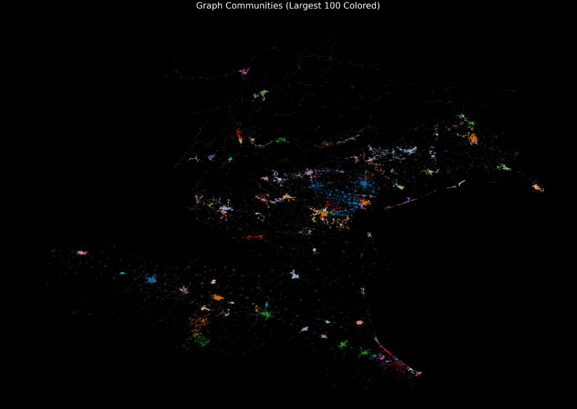

# Urban Graph Sampling on Road Networks

Project for the *Learning from Networks* course (University of Padova). Given
a huge road network extracted from OpenStreetMap, the goal is to identify
"urban" sub-areas, detect communities within them, and compare strategies for
sampling a small, representative subset of nodes out of a much larger graph.

Developed with [Giulia Beraldo](https://github.com/giuliaberaldo2002); tested
end-to-end on the Bremen extract and scaled up to the Nord-Est Italy extract
(~10M+ nodes) on the university's SLURM cluster.

## Pipeline

The project is a sequence of scripts, each consuming the pickle produced by
the previous one:

| Step | Script | What it does |
|---|---|---|
| 1. Parse | `src/graph_init.py` | Parses the raw `.osm.pbf` with Pyrosm, builds a NetworkX `MultiDiGraph`, simplifies topology with OSMnx, adds travel time/speed, converts to `igraph` and pickles the result. |
| 2. Features | `src/compute_features.py` (+ `graph_features.py`) | Computes per-node tag-based features (road type frequencies, avg. maxspeed) and topological features (degree, clustering coefficient, avg. edge length). |
| 3. Tune | `src/urbanity_tuning.py` | Learns a weight vector via constrained random search so that a linear "urbanity score" separates urban from rural nodes, using heuristic anchors. |
| 4. Prune | `src/urban_pruning_final.py` | Standardizes features, computes the urbanity score, fits a 2-component Gaussian Mixture Model, and keeps only nodes classified as urban. |
| 5. Reconnect | `src/fix_connectivity.py` | Pruning can disconnect the graph; this reconnects components by building a k-NN graph between component centroids (cKDTree) and adding its minimum spanning tree as virtual edges. |
| 6. Communities | `src/leiden_communities_undirected.py` | Converts the graph to undirected, sweeps the Leiden resolution parameter (CPM or modularity), and keeps the best partition as a `community` node attribute. |
| 7. Sample & compare | `src/sampling.py`, `src/compare_algorithms.py` | Implements three sampling strategies — round robin over communities, Farthest-First Traversal, and a hybrid — and benchmarks them against random baselines on coverage, diversity, and balance metrics. |
| — | `src/check_connectivity.py`, `src/visualize_clusters.py` | Diagnostics (community size distribution) and static map visualizations of the detected communities. |

`old_files_and_alternatives/` keeps earlier, superseded versions of a few
scripts for reference.

## Results

Communities detected by Leiden on the Nord-Est Italy road network (100 largest
colored, rest in grey):



`plots/` also contains the evaluation plots comparing sampling strategies
(coverage, diversity, balance, efficiency, see `reports/FinalReportLFN.pdf`
for the full write-up and discussion of the results).

## Running it

Raw `.osm.pbf` extracts are not included in the repo (tens of MB to several
GB), download one from [Geofabrik](https://download.geofabrik.de/). Bremen
is small enough to run locally end-to-end; larger regions (e.g. Nord-Est
Italy) need a machine with a lot of RAM, we ran those on a SLURM cluster,
see `src/run_*.sh` for the job scripts and `reports/Running-on-cluster.txt`
for cluster setup notes.

```bash
pip install -r requirements.txt

python src/graph_init.py --input bremen-251019.osm.pbf --output bremen_processed_graph.pkl
python src/compute_features.py --input bremen_processed_graph.pkl --output bremen_with_features.pkl
python src/urbanity_tuning.py --input bremen_with_features.pkl --output urbanity_weights.json
python src/urban_pruning_final.py --input bremen_with_features.pkl --weights urbanity_weights.json --output bremen_pruned.pkl
python src/fix_connectivity.py --input bremen_pruned.pkl --output bremen_pruned_connected.pkl
python src/leiden_communities_undirected.py --input bremen_pruned_connected.pkl --output bremen_with_communities.pkl
python src/compare_algorithms.py --full bremen_processed_graph.pkl --pruned bremen_with_communities.pkl --outdir comparison_results
```

## Reports

- `reports/ProjectProposal.pdf` — initial proposal
- `reports/MidTermReportLfN.pdf` — mid-term progress report
- `reports/FinalReportLFN.pdf` — final report with methodology and results
